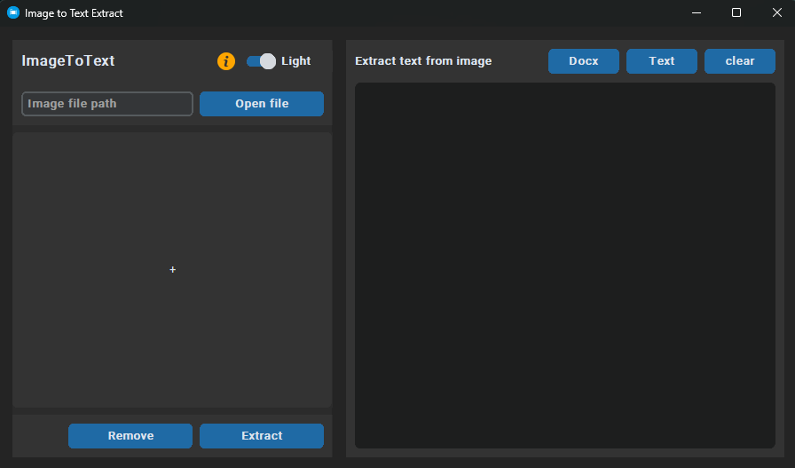
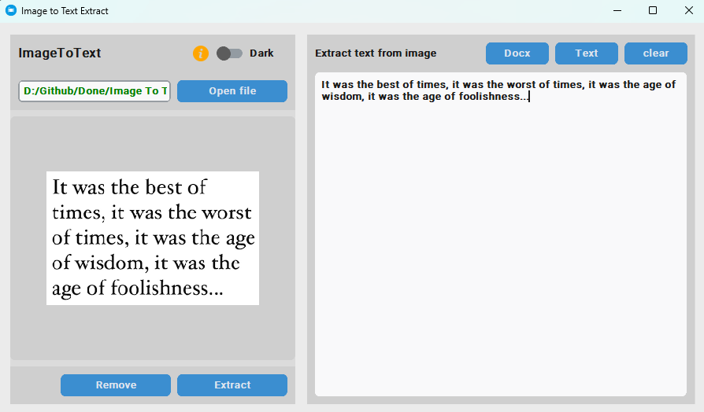
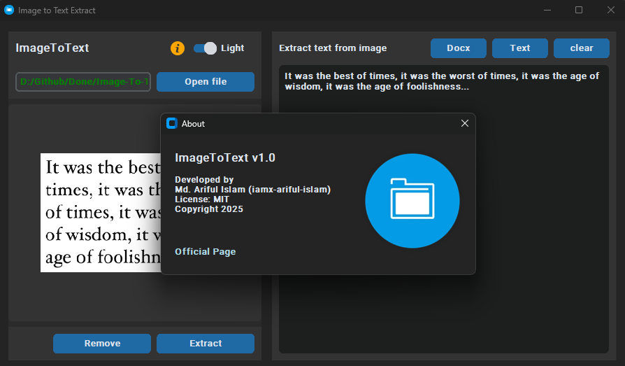

# 🖼️ Image To Text (OCR using Python)

Convert images into editable and searchable text using **Tesseract OCR** and **Python**. This tool extracts text from images (like scanned documents, screenshots or handwritten notes) with high accuracy. Using **CustomTkinter** for graphical user interface.


## 📌 Technologies Used

### **Tkinter**
Tkinter is Python’s standard GUI library used for building cross-platform desktop applications.

### **CustomTkinter**
[CustomTkinter](https://github.com/TomSchimansky/CustomTkinter) extends Tkinter with:

- Modern, consistent design  
- Light & Dark themes  
- High-DPI scaling  
- Fully customizable modern widgets  

Together, they ensure a smooth UI experience on **Windows**, **macOS** and **Linux**.

| Component | Description |
|------------|--------------|
| **Language** | Python 3.x |
| **GUI Framework** | CustomTkinter |
| **Core Libraries** | Tkinter, CustomTkinter |
| **Software Engine** | _`Tesseract-OCR`_ |


## 🚀 Features

- 📸 Extracts text from any image file (`.jpg`, `.png`, `.bmp` etc.)
- 🧠 Uses **Tesseract OCR** for optical character recognition
- 💬 Supports multiple languages (English by default)
- 🪶 Lightweight, fast and easy to integrate into other projects
- 📂 Batch image processing supported
- 💻 Cross-platform (Windows, Linux, macOS)


## 🧰 Installation Steps

### Step 1. Install Tesseract OCR

Download and install **Tesseract-OCR**:

- 🔗 [Tesseract OCR GitHub](https://github.com/tesseract-ocr/tesseract)
- 🔗 [Windows Installer (UB Mannheim)](https://github.com/UB-Mannheim/tesseract/wiki)

After installation, find the **installation path** (for example): `C:\Program Files\Tesseract-OCR\tesseract.exe`<br/>
Add this path into your python script or system PATH.

### Step 2. Clone the repository

```bash
git clone https://github.com/iamx-ariful-islam/Image-To-Text.git
cd Image-To-Text
```

### Step 3. Install Python Dependencies

The `requirements.txt` file, lists of all the Python libraries that "**_image to text_**" depends on and installs those packages from the file:

```bash
pip install -r requirements.txt
# or
sudo pip install -r requirements.txt
```

### Step 4. Run the Application
```bash
python main.py
```


## 📂 Folder Structure
Here’s the structure of the **Image To Text** project:

```bash
image-to-text/
│
├── screenshots/
├── example.png
├── main.py
├── notes.txt
│── LICENSE
├── README.md
└── requirments.txt
```


## 🖼️ Screenshots

Here are some screenshots of the `Image To Text` project:

**Main Window**<br/>

**Output Main Window**<br/>

**About Main Window**<br/>



## 📄 Notes File (How it works)
View full notes here: 👉 [notes.txt](notes.txt)

1. Download and install 'Tesseract OCR' on your computer.
2. Locate the 'Tesseract OCR' installation path after installation.
3. Add the 'Tesseract OCR' installation path to your program configuration or environment variables.
4. Install the required Python packages using: 'pip install -r requirements.txt'


## 🤝 Contributing

Contributions, suggestions, and feedback are always welcome! ❤️<br/>
To contribute:

1. Fork the repository
2. Create a new branch (`feature/new-feature`)
3. Commit your changes
4. Push and submit a Pull Request

💬 You can also open an issue if you’d like to discuss a feature or report a bug.


## 🌐 For more or connect with me

<p align='center'>
  <a href="https://github.com/iamx-ariful-islam"></a>&nbsp;&nbsp;
  <a href="https://bd.linkedin.com/in/iamx-ariful-islam"></a>&nbsp;&nbsp;
  <a href="https://x.com/mx_ariful_islam"></a>&nbsp;&nbsp;
  <a href="https://www.facebook.com/iamx.ariful.islam/"></a>
</p>


## 📜 License

The [MIT](https://choosealicense.com/licenses/mit/) License (MIT)


## 💖 Thank You for Visiting!

> “Good design is about making things simple yet significant”  
> — *Md. Ariful Islam*
